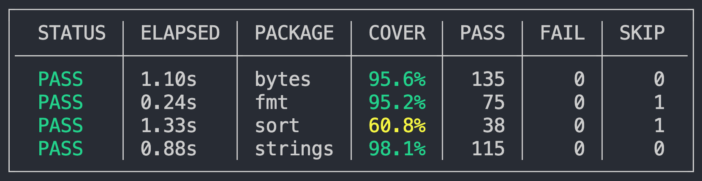

# Getting started

If you have Go installed, try this out:

1 -  Install tparse locally

```bash
go install github.com/mfridman/tparse@latest
```

2 - Execute tests for familiar Go packages and pipe the output to tparse. 

```bash
go test fmt strings bytes sort -cover -json -count=1 | tparse
```

!!! info ""

    **Make sure to run `go test` with the `-json` flag**

This is where the magic happens 🪄.

tparse parses JSON output as tests are being executed. Once tests are done it'll output a summarized table of all the packages, time elapsed, coverage, number of tests and their status. Example:

{ width="auto" }


But wait, there's much more...
